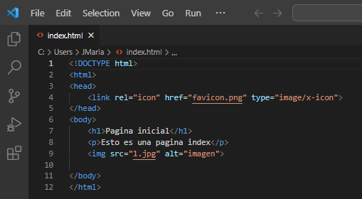
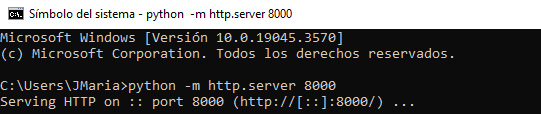
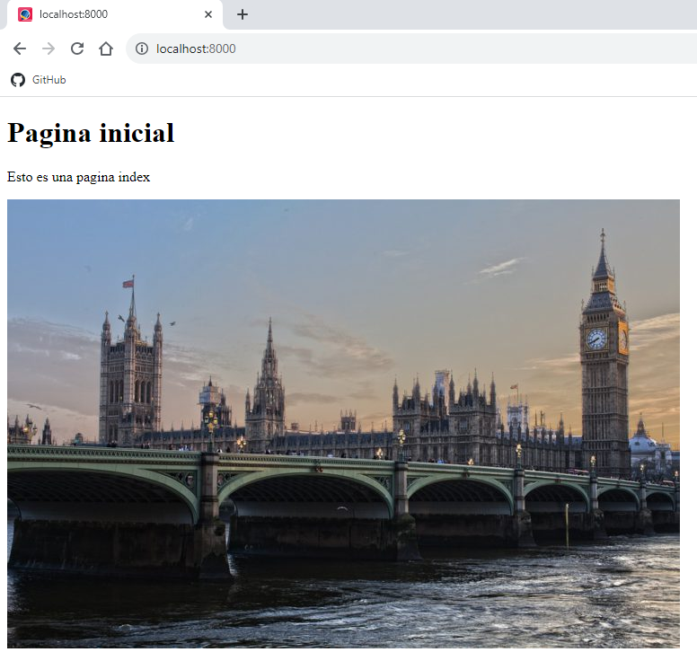

Lo primero que necesitamos para este ejercicio es crear nuestra web con nuestro editor preferido.

Despues necesitamos poner en marcha nuestro servidor Python.
Usaremos el comando "python - m http.server 8000"

Si todo esta correcto, podemos verlo llendo a nuestro servidor

Localhost:8000

