Paso 1: Instalar Apache

Primero hago un update de apt

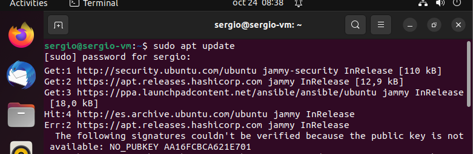

Y ahora procedo a instalar Apache con el administrador de paquetes de Ubuntu, apt

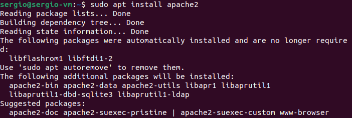

Si la he realizado correctamente, ahora al dirigirme a Localhost deberia aparecer la pagina principal de apache

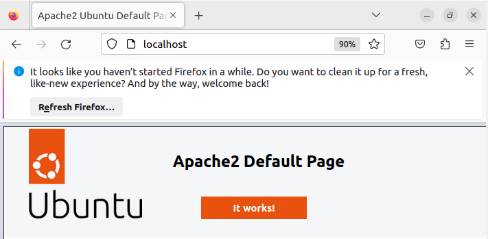

Paso 2: Instalar MySQL.

Ahora procedo a realizar la misma instalacion con SQL.

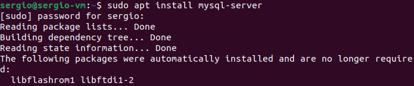

Cuando la instalación se complete, es recomendable ejecutar una secuencia de comandos de seguridad que viene preinstalada en MySQL.
Saldran una serie de pregunta e ire eligiendo que quiero activar y que no.

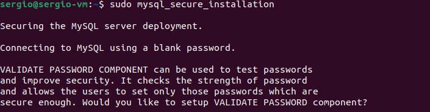

Ahora puedo comprobar si esta instalado correctamente.

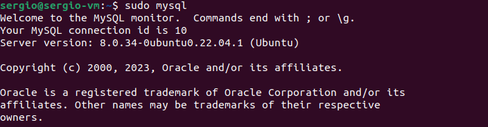

Paso 3: Instalar PHP

Vuelvo a repetir los procesos anteriores pero ahora con PHP.

Y si lo he hecho bien deberia reconocermelo la terminal.

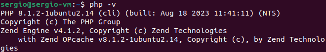

Paso 4: Crear un host virtual para su sitio web

Para crearlo primero necesito crear un entorno donde guardar el dominio.

A continuación, asigno la propiedad del directorio con la variable de entorno $USER

Lo siguiente es configurarlo y accedemos a dicha configuracion con el siguiente codigo.

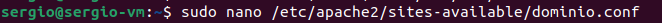

Agregamos las siguientes lineas en la lista de la configuracion.

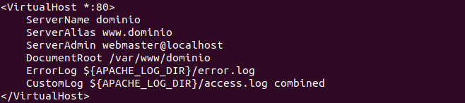

Y a continuacion activo nuestro host virtural

Para evitar que se abra el host de Apache en lugar del nuestro procedo a desactivarlo

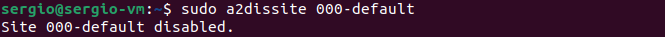

Continuo ahora haciendo una comprobacion para que el codigo no tenga errores de sintaxis.

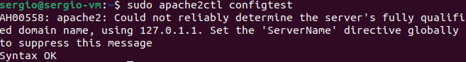

Y finalmente vuelvo a cargar Apache para que los cambios surtan efecto.

Bien, el sitio web esta activo, pero el dominio esta vacio, ahora procedo a crear un index.html

Le añado un poco de contenido a dicho index.

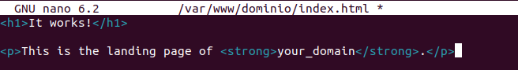

Y finalmente volvemos a probar nuestro localhost

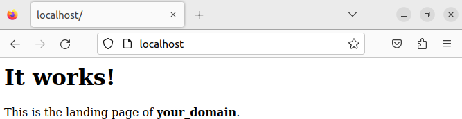
