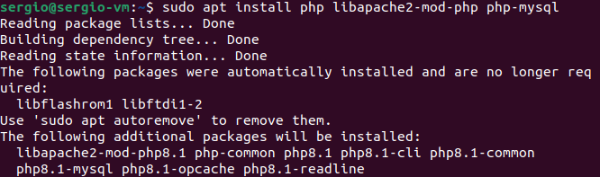

Paso 1: Instalar Apache

Primero hago un update de apt

Y ahora procedo a instalar Apache con el administrador de paquetes de Ubuntu, apt

Si la he realizado correctamente, ahora al dirigirme a Localhost deberia aparecer la pagina principal de apache

Paso 2: Instalar MySQL

Ahora procedo a realizar la misma instalacion con SQL

