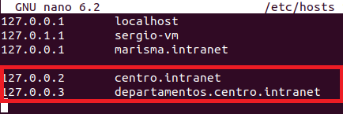
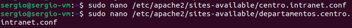
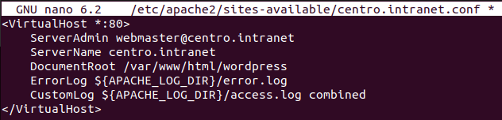
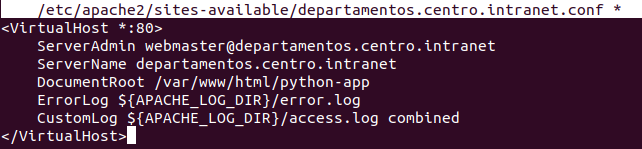
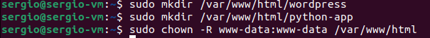
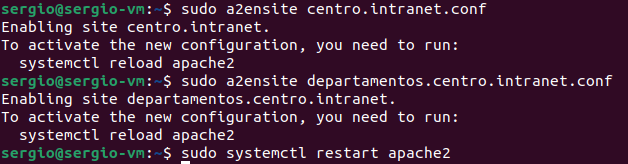

**1) Instalación del servidor web apache. Usaremos dos dominios mediante el archivo hosts: centro.intranet y departamentos.centro.intranet. El primero servirá el contenido mediante wordpress y el segundo una aplicación en python**

Primero hago un update de apt

Luego procedo a instalar Apache

A continuacion tenemos que configurar los hosts, usando nano, accedemos al archivo y agregamos las dos siguientes lineas

Y reiniciamos apache

Ahora debemos crear y configurar los archivos de VirtualHost

Dentro de cada respectivo archivo de configuracion debemos colocar las siguientes lineas

A continuacion creamos los directorios correspondiente y le damos los permisos pertinentes

Habilitamos ambos sitios y reiniciamos apache nuevamente

Activar los módulos necesarios para ejecutar php y acceder a mysql

