**1) Instalación del servidor web apache. Usaremos dos dominios mediante el archivo hosts: centro.intranet y departamentos.centro.intranet. El primero servirá el contenido mediante wordpress y el segundo una aplicación en python**

Primero hago un update de apt

Luego procedo a instalar Apache

A continuacion tenemos que configurar los hosts, usando nano, accedemos al archivo y agregamos las dos siguientes lineas

Y reiniciamos apache

Ahora debemos crear y configurar los archivos de VirtualHost

Dentro de cada respectivo archivo de configuracion debemos colocar las siguientes lineas

A continuacion creamos los directorios correspondiente y le damos los permisos pertinentes

Habilitamos ambos sitios y reiniciamos apache nuevamente

**Activar los módulos necesarios para ejecutar php y acceder a mysql**

Procedemos a activar php (En mi caso ya tenia instalado php, de no ser el caso, primero se haria un sudo apt-get install php)

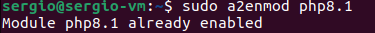

Activamos el modulo de apache para el manejo de URLs en WordPress y reiniciamos apache

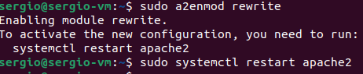

Ahora procedemos a instalar MySql, mas un reset de apache

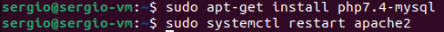

**Instala y configura wordpress**

Debemos crear una base de datos y para ello vamos a utilizar nuestro recien instalado MySQL
Primero iniciamos sesion en MySQL

Una vez dentro, debemos crear una base de datos, introduciendo estos datos (donde pone "sergio" es el nombre del usuario, se le puede dar el que prefiera y el numero "171990" es la contraseña, nuevamente, se pone la que se prefiera)

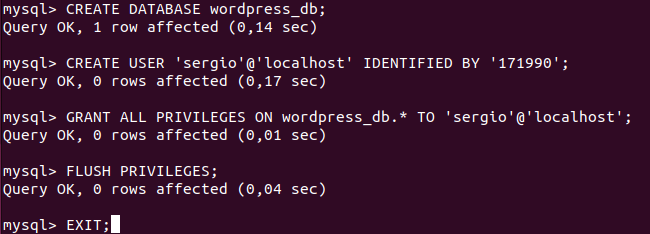

Ahora vamos a proceder a descargar e instalar WordPress

nos movemos al directorio /tmp y descargamos el .tar de wordpress

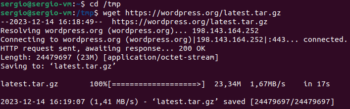

Ejecutamos el tar que se encargara de descargar los componentes necesarios para instalar wordpress

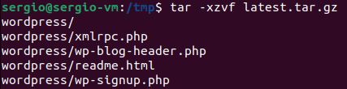

Movemos los archivos al directorio raiz y les concedemos permisos

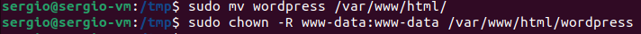

A continuacion nos movemos nosotros al directorio de wordpress, creamos una copia de la plantilla de configuracion y accedemos a ella

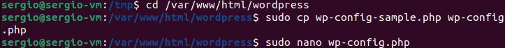

Aqui debemos definir la conexion a la base de datos, usando el nombre y constreseña que pusimos

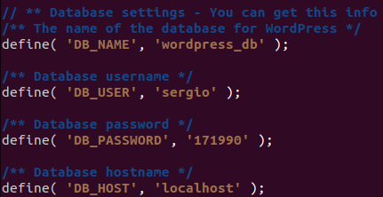

Debemos tambien agregar el .htaccess, por lo que usando nano, accedemos y agregamos el siguiente codigo

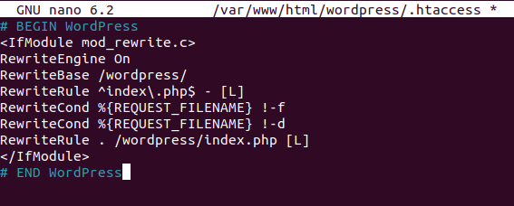

Seguidamente le damos permisos

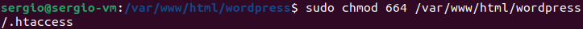

Ahora podemos ir al localhost/worlpress y si lo hemos hecho bien debia salir el asistente de instalacion

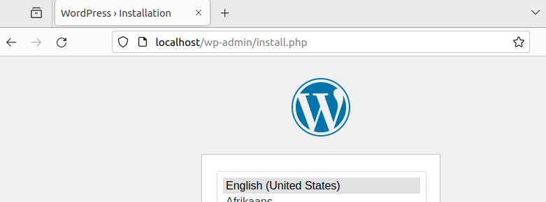

Seguimos los pasos de instalacion y todo transcurre correctamente, podremos acceder a nuestro recien instalado WordPress

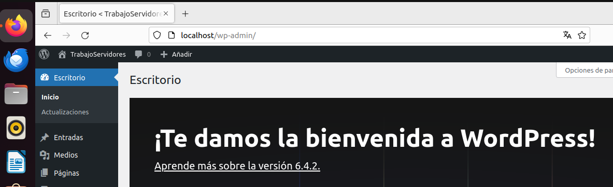

**Activar el módulo “wsgi” para permitir la ejecución de aplicaciones Python**

Como con otras aplicaciones, instalamos wsgi, la habilitamos y reiniciamos apache

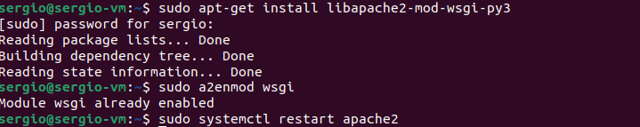

**Crea y despliega una pequeña aplicación python para comprobar que funciona correctamente.**

Creamos nuestra aplicacion, yo he optado por un simple Hola mundo

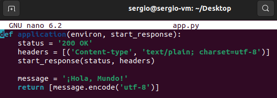

Debemos configurar apache para que maneje la aplicacion, accedemos como otras veces y agregamos el siguiente codigo. Teniendo encuenta las rutas de nuestra app

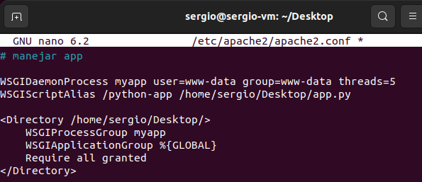

Si todo est bien, accediendo a localhost/phyton-app, podremos ver nuestra app

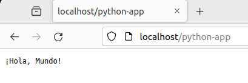

**Adicionalmente protegeremos el acceso a la aplicación python mediante autenticación**

Primero debemos crear un archivo para nuestra contraseña, ojo, te pedira que introduzcas una contraseña, no la olvides

En el, debemos introducir el siguiente codigo, guardamos y reiniciamos apache, con esto ya estaria protegido

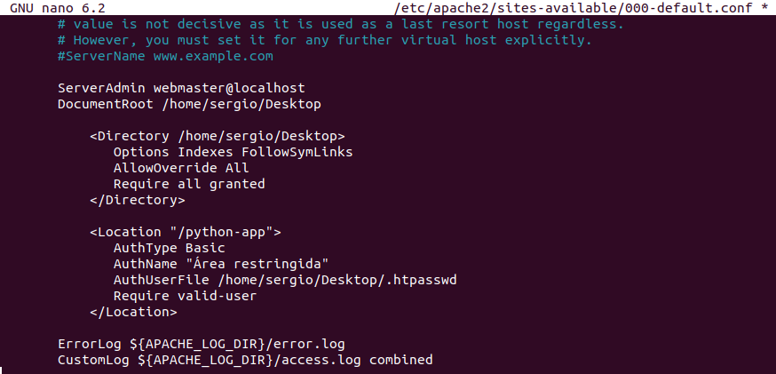

**Instala y configura awstat.**

Como otros veces, instalamos la aplicacion con el siguiente codigo

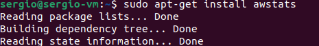

Ahora debemos configurarlo, por lo que accedemos a este

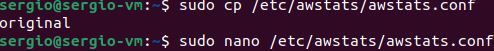

E introducimos el siguiente codigo

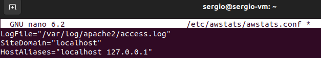

Ahora debemos crear el archivo de configuracion del sitio

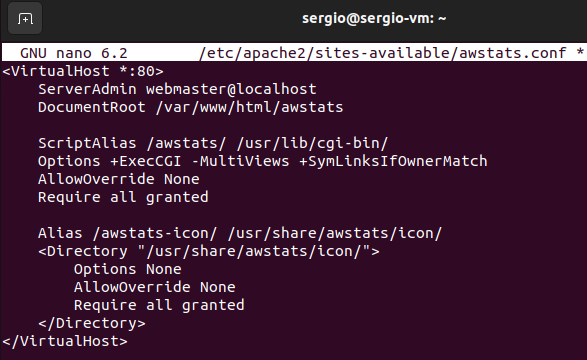

Seguidamente tenemos que crear un enlace simbolico, su directorio y darles los permisos necesarios

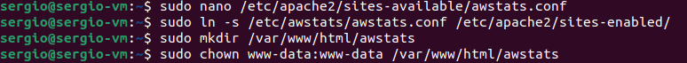

Tambien necesitaremos configurar AQStats para generar los informes, siempre y cueando no se encuentre la siguiente linea, deberemos introducirla nosotros

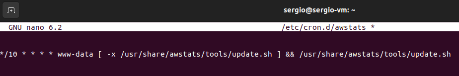

Lo siguiente es configurar el acceso a las estadisticas

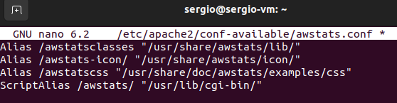

Finalmente habilitamos y reiniciamos apache

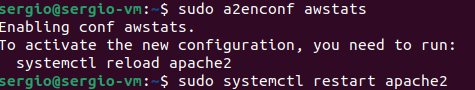

**Instala un segundo servidor de tu elección (nginx, lighttpd) bajo el dominio “servidor2.centro.intranet”. Debes configurarlo para que sirva en el puerto 8080 y haz los cambios necesarios para ejecutar php. Instala phpmyadmin.**

Instalamos Nginx como otros aplicaciones

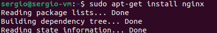

Creamos su respectivo archivo de configuracion con el siguiente codigo

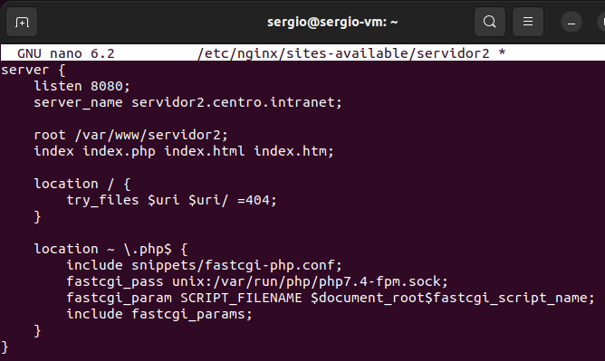

Ahora instalamos phpMyAdmin (durante la instalacion seleccionamos Nginx)

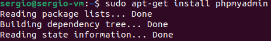

Debemos de agregar al archivo de nginx del site para permitir el acceso a phpMyAdmin el siguiente codigo

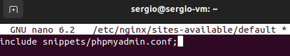

Y con eso ya tendriamos todo completado.
