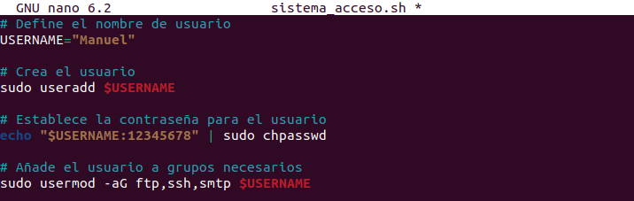
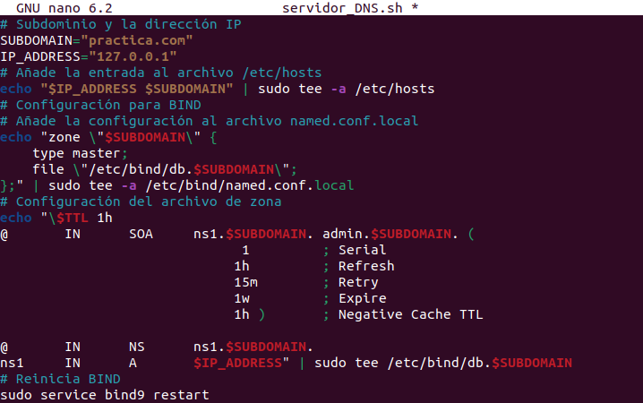

**Instalación, configuración y puesta en marcha de un servidor que ofrezca servicio de alojamiento web configurable**

***1)Instalacion de servicios***

Instalamos vsftpd y ssh.
Otras como Apache, php y phpmyadmin. Ya deberian estar instaladas de ejercicios anteriores.

***2)Configuracion de los servicios***

Creamos un directorio para el sitio web, le damos permisos al directorio y creamos el archivo de configuracion del virtual host.

Dentro del archivo de configuracion agregamos estas lineas.

Lo activamos creando el enlace simbolico y reinicamos el servidor.

Ajustamos la configuracion host

Y comprobamos que todo funciona.

Genial, ahora configuramos el vsftpd para el acceso FTP seguro (TLS).

Y lo reiniciamos

***3)Automatizacion mediante Scripts***

Los siguientes procesos los podemos actualizar.

Empecemos por la creacion de los usuarios, por lo creamos el archivo con nano y lo editamos.

Una vez tengamos nuestro Script, debemos darle permiso y posteriormente, podemos ejecutarlo

Ahora crearemos el sistema para acceso a ftp, ssh, smtp. Por lo que nuevamente creamos el archivo

Le damos permisos y ejecutamos

Aqui podemos ver que la contraseña que use, era debil o mas bien no cumplia con los requisitos. Por lo que cambiamosla a una mas segura

La Ejecutamos y veremos que nos dice que el usuario ya existe, ya que lo ejecutamos antes, pero ya no da problemas con la contraseña.

Para el siguiente Script, antes necesitamos tener instalado bind, en caso negativo, lo instalamos igual que hicimos con otros servicios.

Una vez instalado podemos automatizar los servidores DNS con otro Script.

Nuevamente, le damos permisos y lo ejecutamos.

Para asegurarnos de que se han creado correctamente podemos usar CAT.

LLegados hasta aqui, ahora debemos crear el Script para la creacion de la base de datos con todos los permisos.
Como otras veces, creamos el archivo.

Nuevamente, le damos permisos y ejecutamos.

Por ultimo, debemos automatizar la habilitacion de Python. Creamos un ultimo archivo.

Y para finalizar, permisos y ejecutamos.

