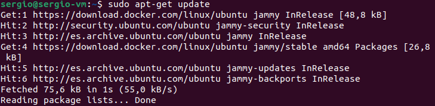

[volver](../Ejercicio2.md)

[activity 2](../actividad2/activity2.md)

***1)Instalacion de Docker***

Primero actualizamos con apt-get update

Ahora instalamos las dependencias curl que vamos a necesitar

Con esto ya terminado, ahora debemos añadir la clave oficial de GPG de Docker, ademas de añadirle le daremos los permisos pertinentes

Ahora debemos añadir el repositorio oficial de Docker

Volvemos a actualizar

Y finalmente instalamos Docker

***OPCIONAL***
Ya tenemos Docker instalado, pero podemos hacer un paso adicional para no tener que estar usando el sudo continuamente

Para ello podemos darle permiso al usuario

Ahora accedemos con el usuario y comprobamos por ejemplo la version de docker

[volver](../Ejercicio2.md)

[activity 2](../actividad2/activity2.md)
