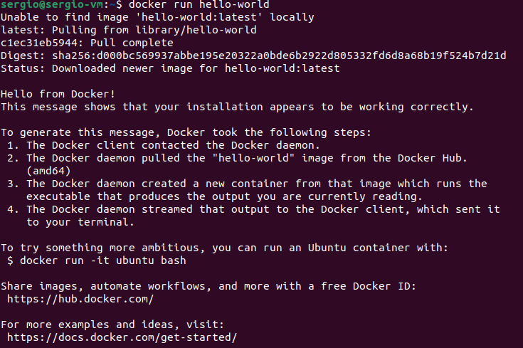
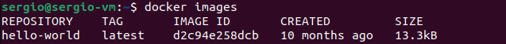
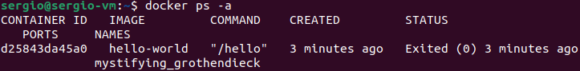
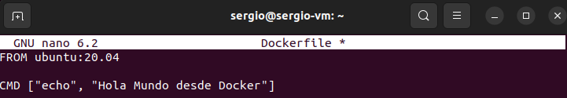
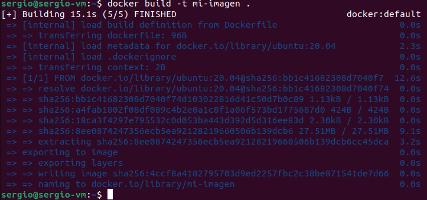
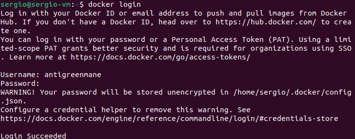
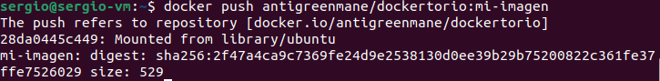
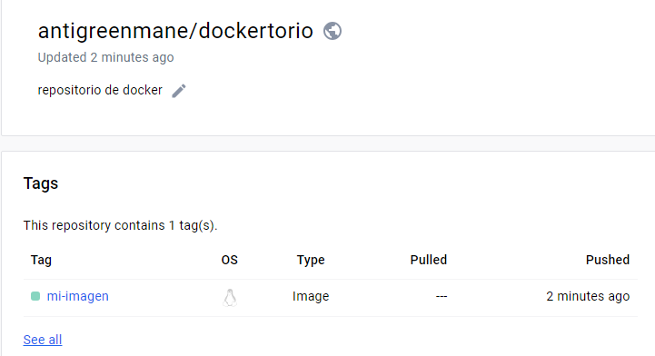

[volver](../Ejercicio2.md)

[activity 3](../actividad3/activity3.md)

***Parte 1 del ejercicio***

*Ejecutar hello-world*

Cargemos la imagen de hola mundo de docker, para ello usamos el comando "docker run hello-world"

Lo primero que intentara sera buscar la imagen localmente, pero como no la tendremos (o no deberiamos tenerla aun) 
lo que hara a continuacion es descargarla desde la libreria de docker

*Imagenes instaladas*

Ahora podemos comprobar las imagenes que tenemos instaladas, como hemos ejecutado hello-world deberia de estar en lista

*Mostrar contenedores*

por ultimo de esta parte, vamos a ver los contenedores que tenemos

***Parte 2 del ejercicio***

Ahora procederemos a crear nuestra imagen y subirla. Vayamos por puntos.

*Editar el fichero Dockerfile*

Editamos el fichero Dockerfile para definir que hara nuestra imagen

*Construir el contenedo*

Ahora debemos construir el contenedor poniendo el nombre que queramos, sere superimaginativo y lo llamara "mi-imagen"

*Ejecútarlo*

Si esta bien hecho, podremos ejecutarlo como otro imagen cualquiera

*Crear una cuenta en hub.docker.com*

la primera parte es sencillo, ir a hub.docker.com y crearse una cuenta.
Una vez creada la cuenta necesitamos logearnos desde nuestra terminal.

*Publícarla*

Antes de publicarla debemos darle un tag a nuestra imagen

Por ultimo solo nos queda publicarla con un push

podemos comprobar que la imagen se ha subido correctamente en hub.docker.com

[volver](../Ejercicio2.md)

[activity 3](../actividad3/activity3.md)
