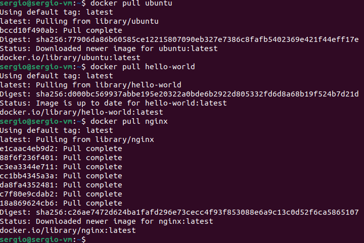
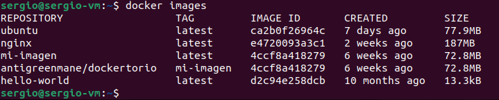
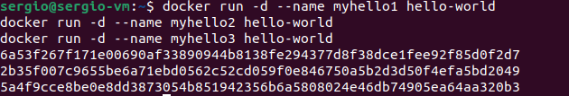
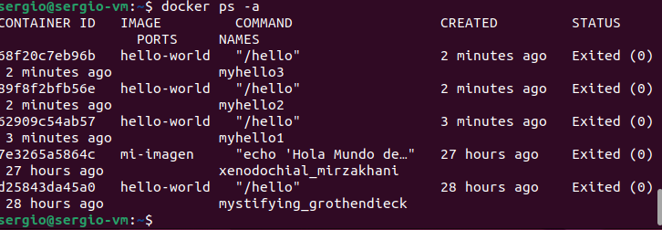
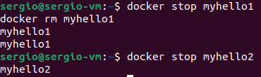
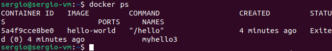
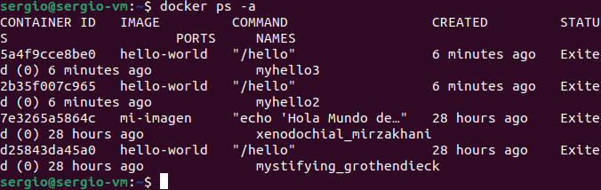
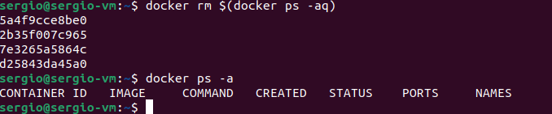

[volver](../Ejercicio2.md)

[activity 2](../actividad4/activity4.md)

***Pull & run, borrar y dar nombres a los contenedores***

Primero vamos a descargar la imagen de ubuntu, hello-world y nginx

Ahora podemos mostrar el listado de las imagenes que tenemos

Lo siguiente que nos pide la tarea es ejecutar tres contenedores hello-world y dale los nombres de “myhello1”,“myhello2” y “myhello3”

Y ahora los mostramos

La siguiente tarea nos pide que detengamos myhello1 y myhello2. Ademas debemos borrar myhello1

Aqui podemos ver aquellos en ejecucion (como hemos detenido el 1 y 2, solo esta el 3)

Y aqui podemos ver tanto los ejecutados como los que no (se ven el 2 y 3, pero no el 1 porque fue borrado)

Por ultimo nos falta la ultima tarea que es borrar todos los contenedores

[volver](../Ejercicio2.md)

[activity 2](../actividad4/activity4.md)
