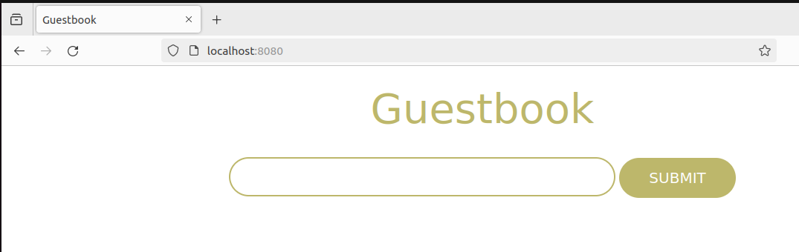

[volver](../Ejercicio2.md)

***Ejemplo 1: Despliegue de la aplicación Guestbook***

Vamos a desplegar una aplicación web que requiere de dos servicios (servicio web y servicio de base de datos)

Para esto necesitaremos los siguientes servicios:

La aplicación guestbook es una aplicación web desarrollada en python que es servida por el puerto 5000/tcp. Utilizaremos la imagen iesgn/guestbook.
Esta aplicación guarda la información en una base de datos no relacional redis, que utiliza el puerto 6379/tcp para conectarnos. Usaremos la imagen redis.

Primeros creamos un red comun para estos

Ahora debemos ejecutar los contenedores, siendo este para Redis

y este otro para iesgn/guestbook

Finalmente comprobamos su funcionamiento

***Ejemplo 2: Despliegue de la aplicación Temperaturas***

Vamos a hacer otro ejemplo, la practica viene a ser la misma, solo que esta vez sera una aplicación que nos permite consultar
la temperatura mínima y máxima de todos los municipios de España. Esta aplicación está formada por dos microservicios:frontend y backend

Creamos una nueva red

Iniciamos el backend

y ahora el frontend

Finalmente comprobamos

***Ejemplo 3: Despliegue de Wordpress + mariadb***

Para la instalación de WordPress necesitamos dos contenedores: la base de datos (imagen mariadb) y el servidor web con la aplicación (imagen wordpress). 
Los dos contenedores tienen que estar en la misma red y deben tener acceso por nombres.

Nuevamente, lo primero sera rear la red

Ejecutamos el contenedor de mariadb

El contenedor de wordpress

Y probamos que funciona

[volver](../Ejercicio2.md)
